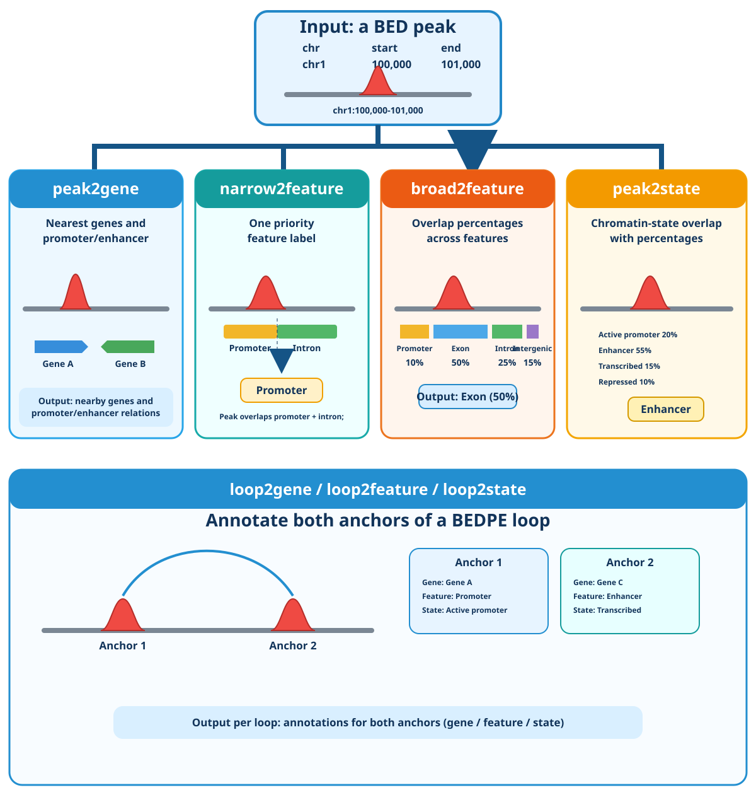

# sjcab_peak2anno

`sjcab_peak2anno` annotates genomic peaks to genes, genomic features, and
chromatin states. It provides the `peak2anno` and `sjcab-peak2anno` command
line interfaces.




## Documentation

Read the full documentation at
[sjcab-peak2anno.readthedocs.io](https://sjcab-peak2anno.readthedocs.io/).

- [Installation](https://github.com/stjudecab/sjcab_peak2anno/blob/master/docs/install.md)
- [Configuration](https://github.com/stjudecab/sjcab_peak2anno/blob/master/docs/configuration.md)
- [Commands](https://github.com/stjudecab/sjcab_peak2anno/blob/master/docs/commands.md)
- [Input and output](https://github.com/stjudecab/sjcab_peak2anno/blob/master/docs/input-output.md)
- [Changelog](https://github.com/stjudecab/sjcab_peak2anno/blob/master/docs/changelog.md)

## Install

Pip version does not require `bedtools` or `pybedtools`; both are detected when
available. Without them, a slower Python interval fallback is used.

```bash
pip install sjcab_peak2anno
```

The conda package requires require `bedtools` or `pybedtools` for faster

```bash
conda install stjudecab::sjcab_peak2anno
```

## Command examples

Annotate a BED peak to nearby genes. Omitting `-o` writes the table to stdout:

```bash
peak2anno peak2gene tests_data/peaks.bed \
  --tss-bed tests_data/tss.bed \
  --prom-enha-cutoffs 2000,50k
```

Example output (tab-delimited):

```text
chr1  50  150  peak1  GeneA  ENSGA  .  .  GeneA  ENSGA  0
```

Run multiple annotations in one table with the combined command syntax using
default hg38 v31:

```bash
peak2anno peak2gene narrow2feature tests_data/peaks.bed \
  --workers 2 -o combined.tsv
```

Representative combined output columns look like this:

```text
chr  start  end  peak  Closest_Gene  FeatureAssignment
chr1 100000 101000 peak1 GeneA        Promoter
```

Annotate both anchors of a BEDPE loop with `loop2gene`, `loop2feature`, or
`loop2state`:

```bash
peak2anno loop2gene loops.bedpe --tss-bed annotations/hg38/tss.bed -o loops.tsv
```

Representative loop output contains separate anchor columns:

```text
chr1 100000 101000 chr1 200000 201000 anchor1_Closest_Gene anchor2_Closest_Gene
chr1 100000 101000 chr1 200000 201000 GeneA                 GeneC
```

